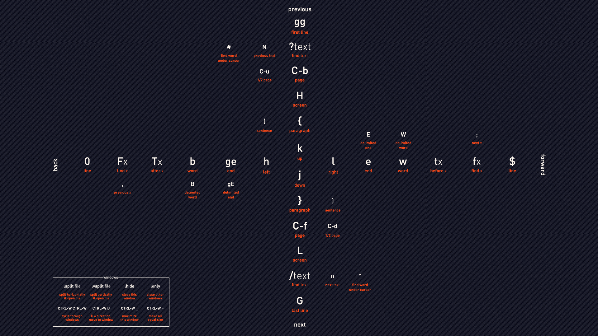

# 前言

为了即使用pycharm中诸多强大的IDE功能，又使用vim方便的快捷键，使用ideavim实现pycharm下
的vim功能。ideavim插件目前并未实现所有vim的所有功能。所以根据*Pactical Vim*做整理，
方便日后忘记时及时查询。

# 快捷移动

## 普通模式下的快捷移动：

这张图形象的说明了普通模式下的光标移动，其中也包括在查找中的快速移动。

## 在匹配的括号之间跳转

**%** 被用于在匹配的括号之间快速跳转

## 标记位置，快速跳转

**m{a-zA-Z}** 用于快速标记
**`{a-zA-Z}** 用于跳转到标记

|按键|跳转效果|
|:-:|:-:|
|**``**|当前文件中上次跳转动作前的位置|
|**`.**|上次修改的地方|
|**`^**|上次插入的地方|
|**`[**|上次修改或复制的起始位置|
|**`]**|上次修改或复制的结束位置|
|**`<**|高亮选区的起始位置|
|**`<**|高亮选区的结束位置|

# 文本对象-精确选择

文本对象可配合**d**,**y**,**c**等命令配合使用  
vimd的文本对象由两个字符组成：  

1. 第一个单词为**i**(inside)或者**a**(around)。  
2. 第二个单词表示具体的对象：

|按键|范围|
|:-:|:-:|
|**)**|一对圆括号|
|**}**|一对花括号|
|**]**|一对方括号|
|**]**|一对方括号|
|**>**|一对尖括号|
|**'**|一对单引号|
|**"**|一对双引号|
|**`**|一对反引号|
|**t**|一对xml标签|

# 插入模式的快捷键

|按键|用途|
|:-:|:-:|
|**\<C-h>**|删除光标左边字符|
|**\<C-w>**|删除光标左边单词|
|**\<C-u>**|删除至行首|
|**\<C-y>**|粘贴上方字符|
|**\<C-e>**|粘贴下方字符|
|**\<C-r>{register}**|粘贴寄存器|
|**\<C-a>**|插入前一次插入模式所键入的内容|
|**\<C-o>**|插入-普通模式|

# 粘贴复制-寄存器

vim有多组寄存器，可实现多样的复制、粘贴功能。  
使用方法：

* 复制 **{register}[d/c/y]{motion}**
* 粘贴 **{register}[p/P]**

可选择高亮区域，通过粘贴覆盖选择区域。

## 寄存器类别
  
* 无名寄存器("")，默认寄存器。**x**,**s**,**d**,**c**,**y**均会覆盖无名寄存器的内容。
* 复制专用寄存器("0)，只有复制时才会拷贝至该寄存器。
* 有名寄存器("a-"z)，使用大写字母，
* 黑洞寄存器("_)，有去无回。
* 系统剪贴板("+)
* 选择专用寄存器
* ~~表达式寄存器~~
* 其它寄存器

# 命令行模式

命令行模式可以在任意位置执行，在一些情况下能够比普通模式命令更快地完成工作。

# 替换

:s/word1/word2/g
:n1,n2s/word1/word2/g
:s/word1/word2/gc -> need confirm